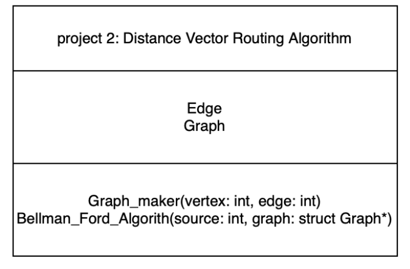
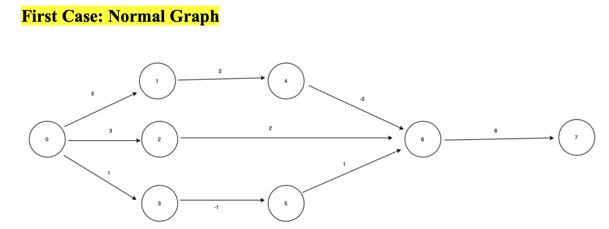
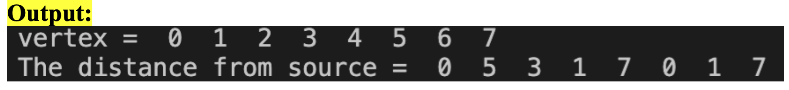
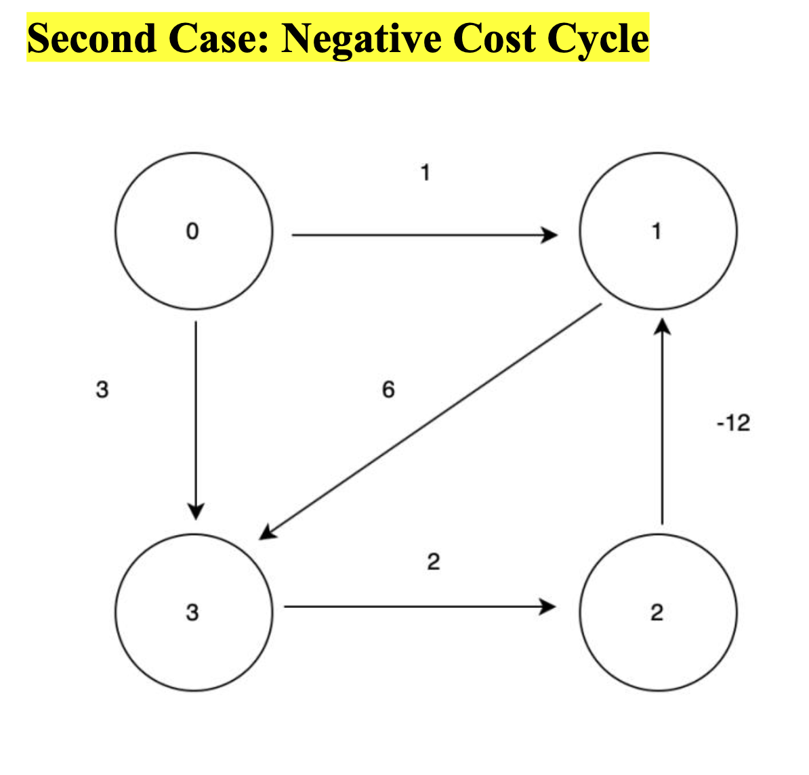
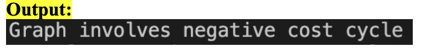

# Justification of Programming Language

I have chosen to program in C++ for this project because it allows more involvement on my part compared to if I was programming in Python due to the libraries that exist for Python. C++ is also faster than Python, which is another reason why I chose C++. The average time complexity is O(n^2) & worst case is O(n^3) based on the distance vector routing algorithm.

  

# UML Diagram/Design 

  

# Overview
*2 cases that I have chosen to run the distance vector routing algorithm are shown below with their outputs. The first case is a normal graph and the second case of a negative cost cycle.*

  

# Diagrams & Outputs of First and Second Case

  

